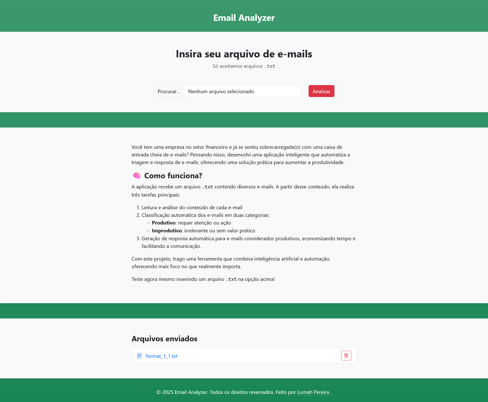
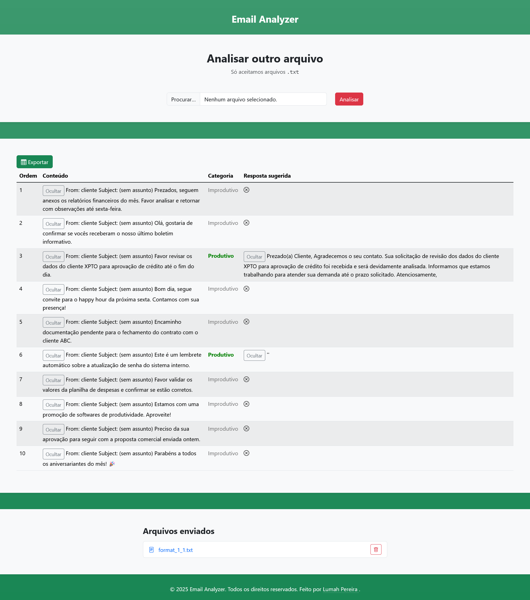

# Email Analyzer
         

Você tem uma empresa no setor financeiro e já se sentiu sobrecarregada(o) com uma caixa de entrada cheia de e-mails? Pensando nisso, desenvolvi o **Email Analyzer**, uma aplicação inteligente que automatiza a triagem e resposta de e-mails, oferecendo uma solução prática para aumentar a produtividade.

## Deploy
Clique [aqui](https://email-analyzer-eight.vercel.app/) para acessar a aplicação.

## Tecnologias utilizadas
- **Frontend**: HTML, CSS, JavaScript;
  - Bootstrap, jQuery.
- **Backend**: Python;
  - Flask, NLTK, dotenv, Google Gemini API, sklearn.
- **Banco de dados**: local storage.

## Screenshots

## Funcionalidades
A documentação das funcionalidades está disponível [aqui](./docs/funcionalidades.md).

## Estrutura do projeto
A estrutura do projeto disponível [aqui](./docs/estrutura.md).

## Como rodar localmente
O tutorial de como rodar localmente está  disponível [aqui](./docs/run.md).

## APIs
A documentação dos endpoints está disponível [aqui](./docs/apis.md).

## Possíveis melhorias
- [ ] Adicionar modais de carregamento;
- [ ] Permitir criação de contas;
- [ ] Melhorar a categorização dos emails;
- [ ] Melhorar as respostas geradas;
- [ ] Adicionar mais padrões para o algoritmo de extração dos conteúdos dos emails.

## Autora

***Lumah Pereira***

  
