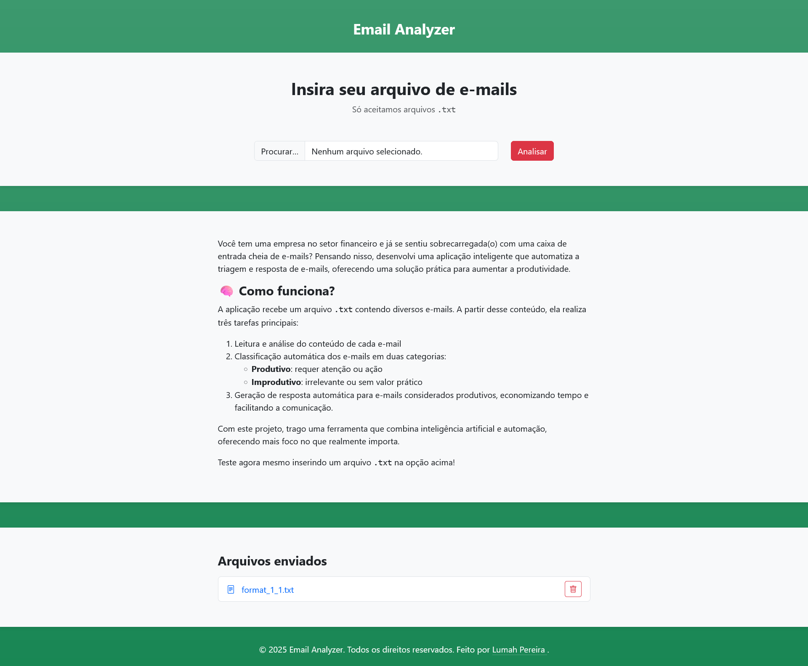
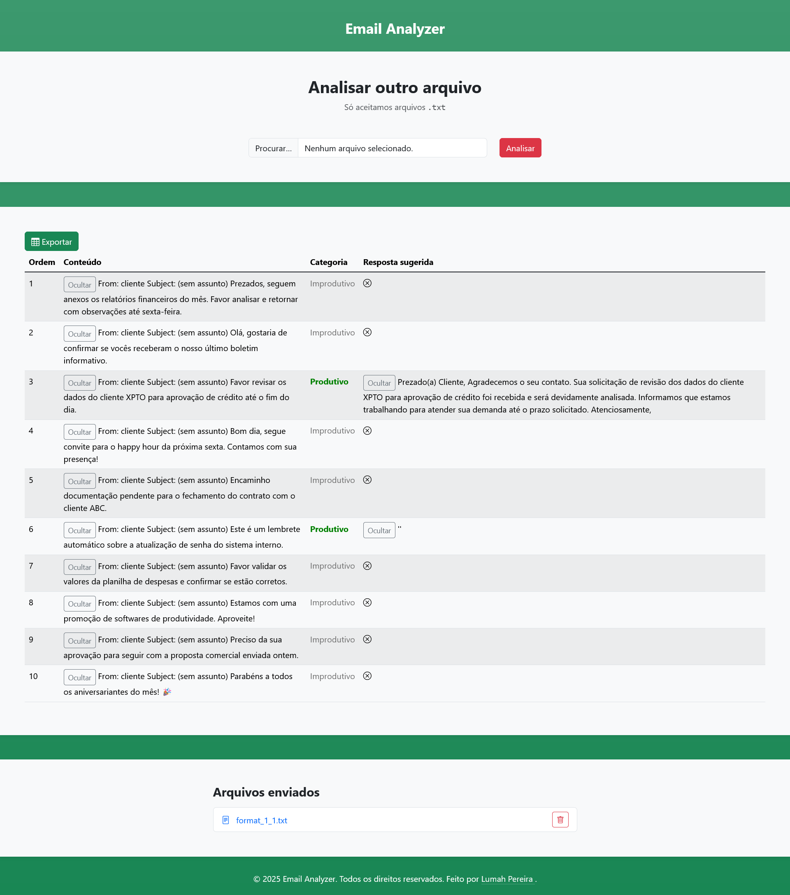

# 📫 Classificador de E-mails com Machine Learning
Você é dono de uma empresa no setor financeiro e já se sentiu sobrecarregado por uma caixa de entrada lotada de e-mails? Pensando nisso, desenvolvi o **Email Analyzer**, um aplicativo inteligente que automatiza a triagem e a resposta de e-mails, oferecendo uma solução prática para aumentar a produtividade.

## Tecnologias
- **Frontend**: HTML, CSS, JavaScript;
- Bootstrap, jQuery.
- **Backend**: Python;
- Flask, NLTK, dotenv, Google Gemini API, sklearn.
- **Banco de Dados**: local storage.

## Screenshots

## Funcionalidades
A documentação das funcionalidades está disponível [aqui](./docs/funcionalidades.md).

## Estrutura
A estrutura do projeto está disponível [aqui](./docs/estrutura.md).

## Como executar localmente
O tutorial sobre como executar localmente está disponível [aqui](./docs/run.md).

## APIs
A documentação dos endpoints está disponível [aqui](./docs/apis.md).
