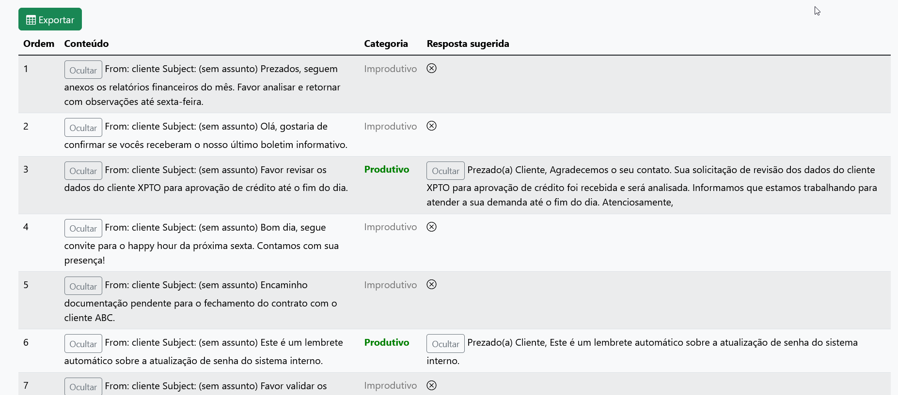
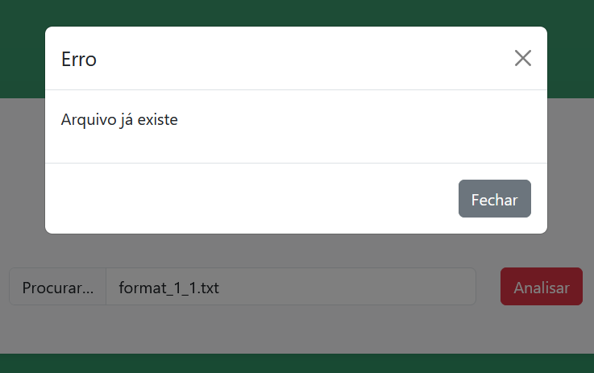
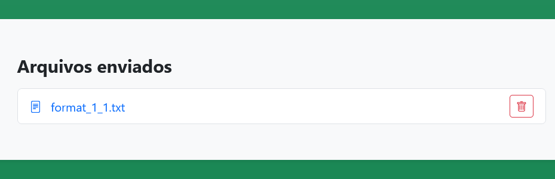
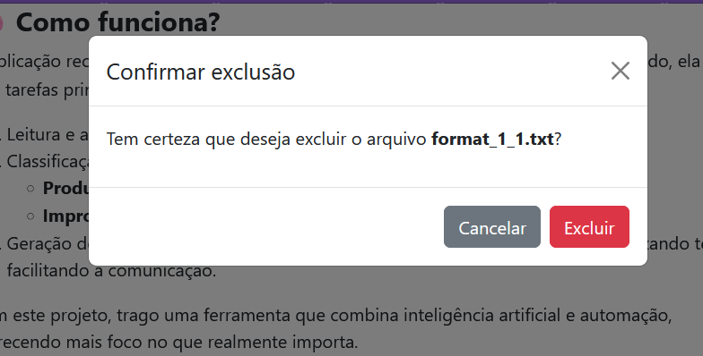
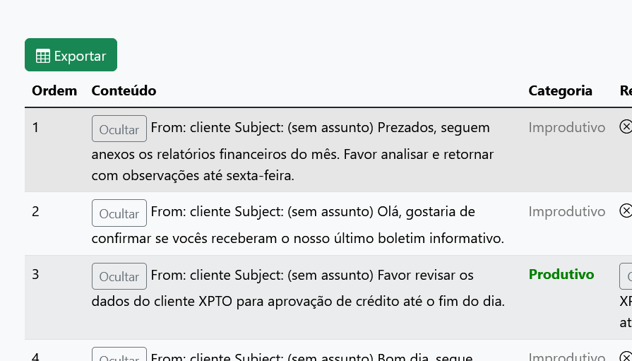
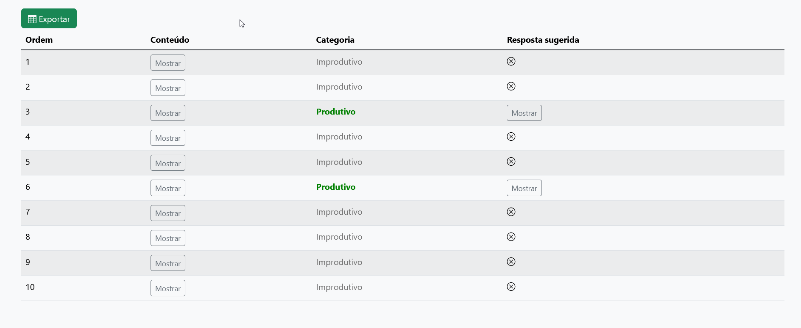

# Features
## 1. .txt file analysis
Users can submit .txt files containing content (such as emails or messages) for analysis. Each piece of content is processed for:
- Category prediction with ```predict_category()```
- Automatic response generation (if the category is "Productive") via ```generate_response()```



## 2. Uploading and Storing Files by User
Each uploaded file is stored in a separate directory per user (```uploads/<user_id>/```), with session control (```session['user_id']```), ensuring:
- Organization by user
- Preventing overwriting of existing files



## 3. User File Listing
Users can:
- List all ```.txt``` files they've uploaded
- View the file names and accessible URLs Files



## 4. Reading File Contents
Users can view the full content of previously uploaded .txt files.


## 5. Deleting Files
Users can:
- Delete files individually
- Remove empty folders after deletion (automatically)



## 6. Exporting Results
The analysis results (content, category, and generated response) can be exported as an .xlsx file, with a structure ready for use in reports or spreadsheets.



## 7. Session Control and User Identification
The system controls users via:

- ```session['user_id']``` (stored on the server)
- ```X-User-ID``` in the ```HTTP``` header (client can synchronize via API)
- Endpoint to verify if the user is authenticated

## 8. CORS Support
The API supports Cross-Origin Resource Sharing (CORS) to allow calls from frontend clients hosted on different domains.

## 9. Hide/Show Content
If desired, the user can hide the ```Content``` and ```Suggested Response``` fields in the generated analysis, for organizational purposes or better visualization.


