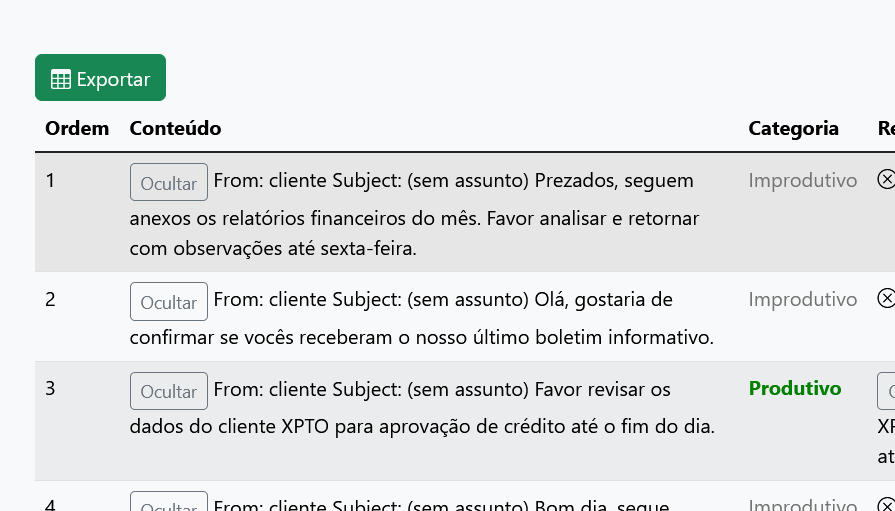

# Funcionalidades
## 1. Análise de arquivos .txt
Usuários podem enviar arquivos .txt contendo conteúdos (como e-mails ou mensagens) para serem analisados.
Cada conteúdo é processado para:
- Predição de categoria com predict_category()
- Geração de resposta automática (se a categoria for "Produtivo") via generate_response()

## 2. Upload e Armazenamento de Arquivos por Usuário
Cada arquivo enviado é armazenado em um diretório separado por usuário (uploads/<user_id>/), com controle de sessões (session['user_id']), garantindo:
- Organização por usuário
- Prevenção de sobrescrita de arquivos existentes

## 3. Listagem de Arquivos do Usuário
Os usuários podem:
- Listar todos os arquivos .txt que enviaram
- Ver os nomes e URLs acessíveis dos arquivos

## 4. Leitura do Conteúdo dos Arquivos
Usuários podem visualizar o conteúdo completo de arquivos .txt já enviados.

## 5. Exclusão de Arquivos
Usuários podem:
- Excluir arquivos individualmente
- Remover pastas vazias após a exclusão (automaticamente)

## 6. Exportação dos Resultados
Os resultados da análise (conteúdo, categoria e resposta gerada) podem ser exportados como um arquivo .xlsx, com estrutura pronta para uso em relatórios ou planilhas.

## 7. Controle de Sessão e Identificação de Usuário
O sistema controla os usuários via:

- session['user_id'] (armazenado no servidor)
- X-User-ID no cabeçalho HTTP (cliente pode sincronizar via API)
- Endpoint para verificar se o usuário está autenticado

## 8. Suporte a CORS
A API suporta Cross-Origin Resource Sharing (CORS) para permitir chamadas de clientes frontend hospedados em domínios diferentes.